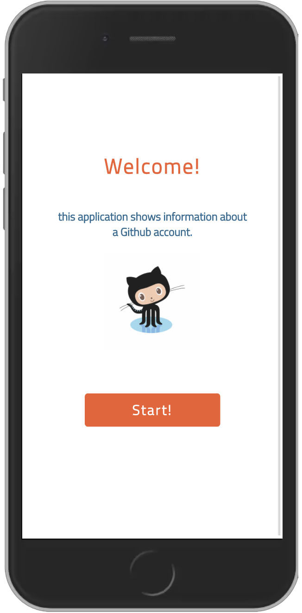
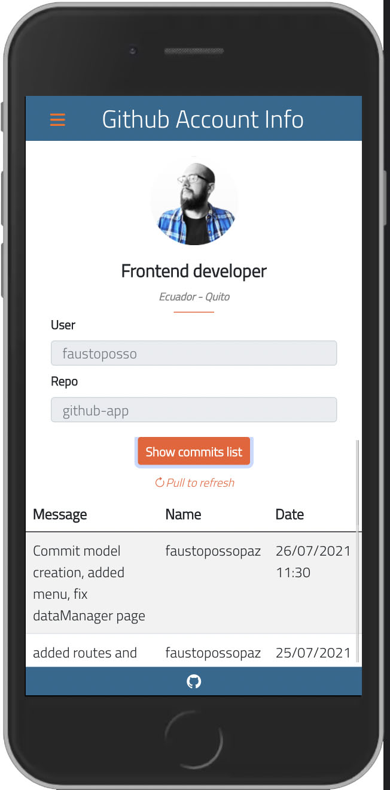
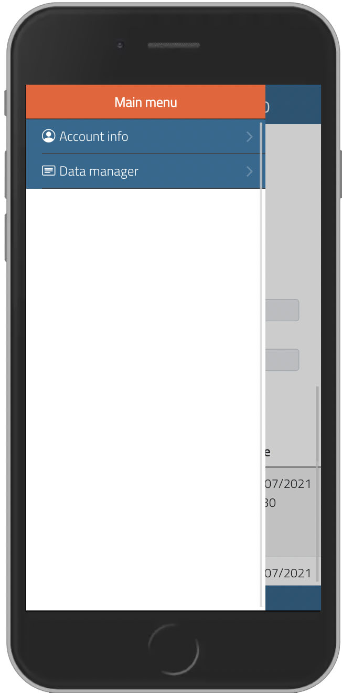
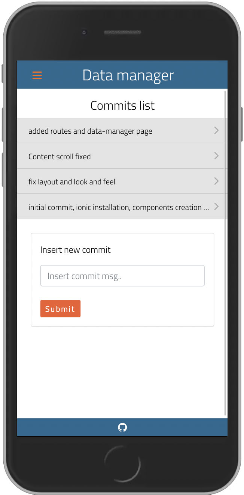

# **Github App**
---
# Introduction

this application shows information about a Github account.

&nbsp;

# Demo 

&nbsp;

# technologies used 🛠️

- HTML5, CSS3, Typescript.
- Angular Framework version 12.0.5
- Ionic Framework version 5.4.5
- Bootstrap Framework verion 5.0.2
- Bootstrap icons Library.
- Moment.js Library.
- Google Font Library.
- Animate.css Library.

# Instructions 🚀 

1. git clone https://github.com/FaustoPosso/github-app.git
2. cd github-app.
2. Execute the command `npm install`.
3. Run Ionic `ionic serve`.
\
&nbsp;

# Author ✒️
 - Fausto Posso. 

---
⌨️ con ❤️ by Fausto Posso Paz 😊
\
&nbsp;
